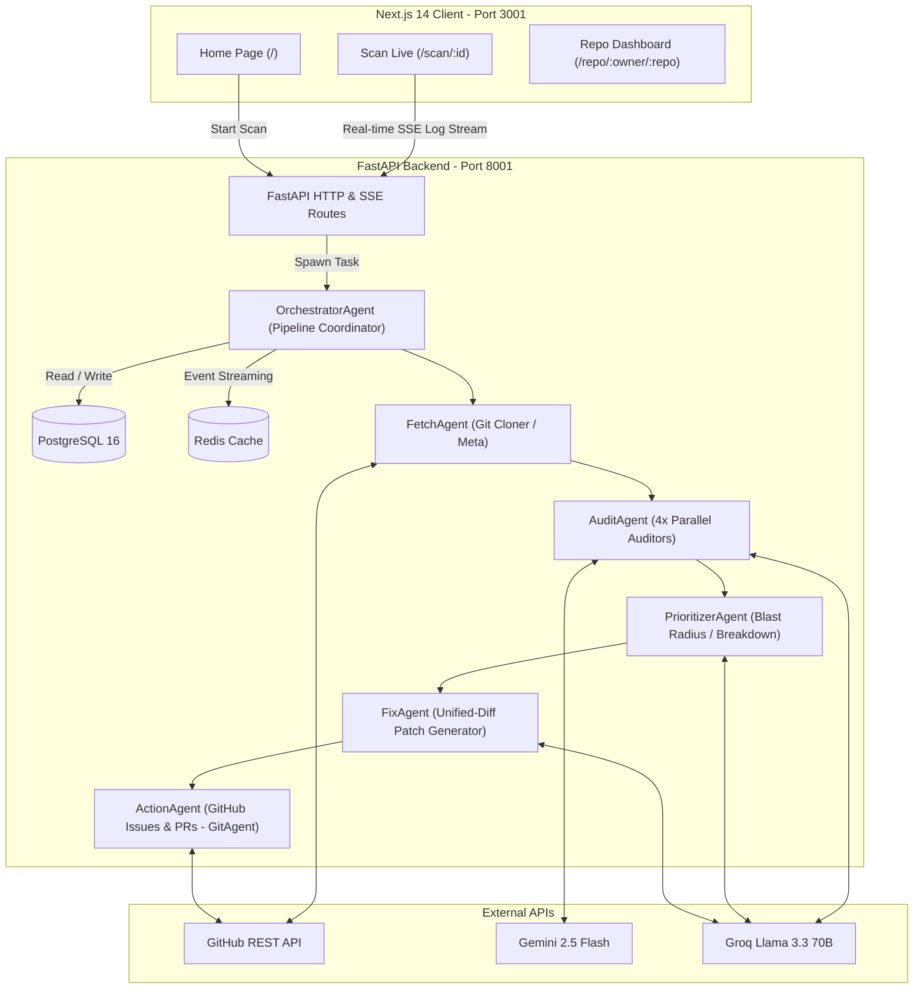
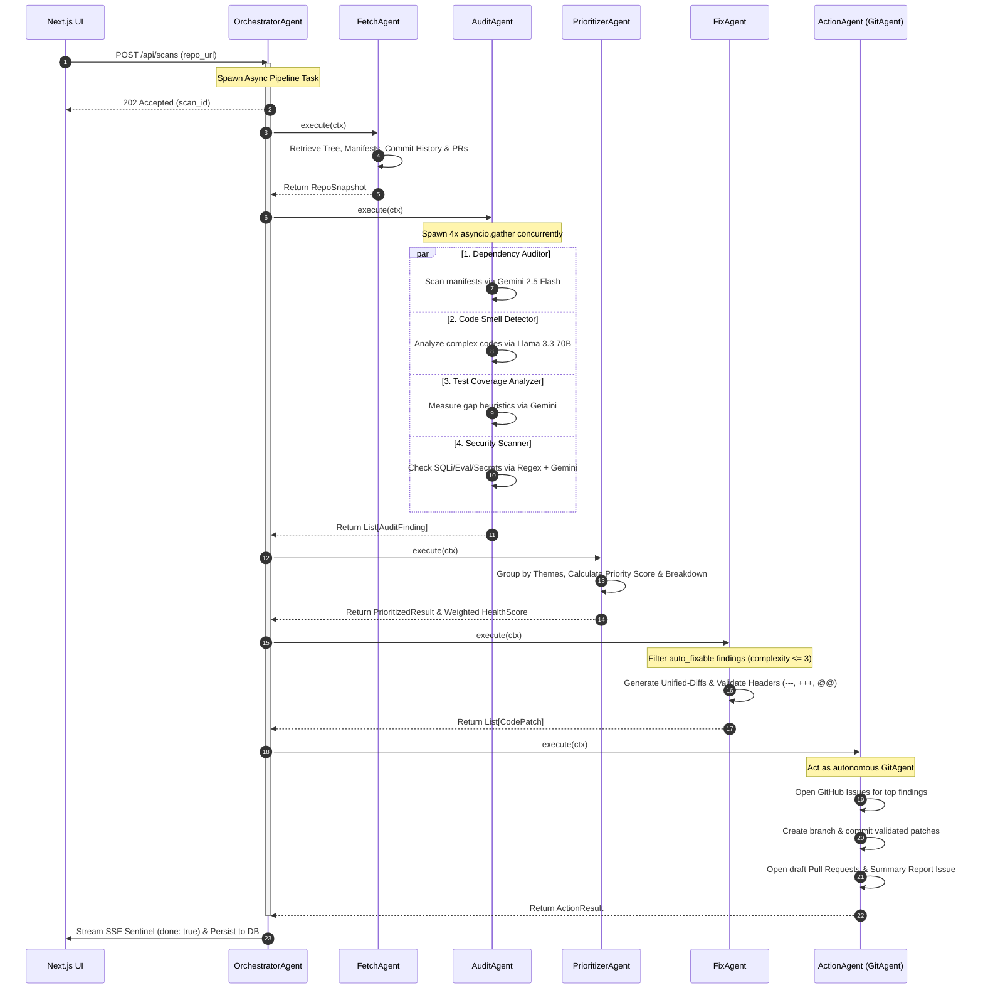

<div align="center">


# 🌿 RepoSage
### Autonomous Multi-Agent GitHub Repository Health & Self-Healing Pipeline

*Crawl. Audit. Prioritize. Patch. Ship — fully automated.*

<br/>

[](https://fastapi.tiangolo.com)
[](https://nextjs.org)
[](https://python.org)
[](https://typescriptlang.org)
[](https://docker.com)
[](https://postgresql.org)
[](https://redis.io)
[](https://docs.pytest.org)
[](LICENSE)

<br/>

> **RepoSage** is a production-grade, six-stage autonomous agent pipeline that scans any public GitHub repository, identifies multi-dimensional vulnerabilities across security, code quality, dependencies, and test coverage — then *automatically generates, validates, and ships unified-diff patches as draft Pull Requests.*

<br/>

[🚀 Quick Start](#-quick-start-dockerized) · [🏗 Architecture](#️-system-architecture) · [🤖 Agent Pipeline](#-deep-dive-the-multi-agent-pipeline) · [📊 API Reference](#-api-reference) · [🧪 Testing](#-asynchronous-unit-testing) · [💡 Design Highlights](#-key-design-highlights)

</div>

---

## 📖 Table of Contents

1. [🌟 What Makes RepoSage Different](#-what-makes-reposage-different)
2. [⚙️ System Architecture](#️-system-architecture)
3. [🤖 Deep Dive: The Multi-Agent Pipeline](#-deep-dive-the-multi-agent-pipeline)
4. [🛠️ Technology Stack](#️-technology-stack)
5. [🚀 Quick Start (Dockerized)](#-quick-start-dockerized)
6. [🔑 Environment Variables](#-environment-variables)
7. [🧪 Asynchronous Unit Testing](#-asynchronous-unit-testing)
8. [📊 API Reference](#-api-reference)
9. [💡 Key Design Highlights](#-key-design-highlights)
10. [🗺️ Roadmap](#️-roadmap)
11. [🤝 Contributing](#-contributing)

---

## 🌟 What Makes RepoSage Different

Most repository scanners are **read-only observers**. They find bugs, print a report, and leave the work to you. RepoSage is different — it *acts*.

| Capability | Traditional Scanners | **RepoSage** |
|---|---|---|
| Finds security vulnerabilities | ✅ | ✅ |
| Detects outdated dependencies | ✅ | ✅ |
| Identifies code smells | ✅ | ✅ |
| Generates actual code patches | ❌ | ✅ |
| Opens GitHub Issues automatically | ❌ | ✅ |
| Creates & commits fix branches | ❌ | ✅ |
| Opens draft Pull Requests | ❌ | ✅ |
| Real-time streaming dashboard | ❌ | ✅ |
| Persists historical health trends | ❌ | ✅ |

### Core Capabilities at a Glance

- **⚡ Async Parallel Auditing** — 4 independent sub-audits run concurrently via `asyncio.gather`, cutting scan time from ~30s sequential to ~8s parallel
- **🧠 Intelligent Model Routing** — Fast triage tasks use Gemini 2.5 Flash (1M token/day free); deep reasoning uses Groq Llama 3.3 70B (14,400 req/day free)
- **🩹 Self-Healing Patches** — Generates syntactically validated unified-diff patches, creates git branches, commits, and opens draft PRs — zero human intervention required
- **📡 Real-Time SSE Stream** — Server-Sent Events broadcast live agent status to a Next.js dashboard with zero polling overhead
- **📈 Historical Health Trends** — PostgreSQL persists every scan; Recharts renders line sparklines and donut breakdowns across security, quality, dependencies, and coverage axes

---

## ⚙️ System Architecture

RepoSage is built on a fully decoupled, event-driven architecture. The frontend never polls — it subscribes to a live SSE stream. The backend coordinates six specialized agents through a shared `AgentContext` state container, persisting results to PostgreSQL and using Redis for event broadcasting between async tasks.



### Port Map

| Service | Internal Port | External (Host) Port |
|---|---|---|
| Next.js Frontend | 3000 | **3001** |
| FastAPI Backend | 8000 | **8001** |
| PostgreSQL | 5432 | **5433** |
| Redis | 6379 | **6380** |

> All inter-service communication uses Docker's internal network (service names as hostnames), not host ports.

---

## 🤖 Deep Dive: The Multi-Agent Pipeline

Every agent inherits from `BaseAgent` and communicates exclusively through the `AgentContext` state container. This enforces a clean data contract: each stage consumes the output of the previous stage without tight coupling.

### Pipeline Overview

```
POST /api/scans
      │
      ▼
OrchestratorAgent ──► spawn async background task ──► return 202 + scan_id
      │
      ├──► [Stage 1] FetchAgent
      │         └── GitHub API: tree, manifests, commit history, open PRs
      │                             │
      ├──► [Stage 2] AuditAgent ◄───┘
      │         ├── [Parallel] DependencyAuditor   ← Gemini 2.5 Flash
      │         ├── [Parallel] CodeSmellDetector   ← Groq Llama 3.3 70B
      │         ├── [Parallel] TestCoverageAnalyzer← Gemini 2.5 Flash
      │         └── [Parallel] SecurityScanner     ← Regex + Gemini
      │                             │
      ├──► [Stage 3] PrioritizerAgent ◄────────────┘
      │         ├── Blast-radius scoring via Llama 3.3
      │         ├── Priority = severity_weight × blast_radius / fix_complexity
      │         └── Weighted health score (0–100)
      │                             │
      ├──► [Stage 4] FixAgent ◄─────┘
      │         ├── Filter: auto_fixable=True, complexity ≤ 3
      │         ├── Generate unified-diff patches via Llama 3.3
      │         └── Validate: must contain ---, +++, @@ markers
      │                             │
      └──► [Stage 5] ActionAgent ◄──┘
                ├── Open GitHub Issues for top findings
                ├── Create branch + commit validated patches
                ├── Open draft Pull Requests
                └── Post summary report Issue
```

### Sequence Diagram



### Agent Responsibilities

#### 🔍 FetchAgent (Stage 1)
Fetches the complete repository snapshot via GitHub REST API without cloning.

- Retrieves full file tree recursively
- Downloads manifest files (`package.json`, `requirements.txt`, `Cargo.toml`, `go.mod`, etc.)
- Reads up to 200 source files (≤ 500 lines each) for analysis
- Pulls last 50 commits and open PRs for context

#### 🔎 AuditAgent (Stage 2)
Runs 4 sub-audits concurrently using `asyncio.gather(return_exceptions=True)`:

| Sub-Auditor | Model | What It Finds |
|---|---|---|
| `DependencyAuditor` | Gemini 2.5 Flash | Outdated packages, CVEs, deprecated libs, version conflicts |
| `CodeSmellDetector` | Groq Llama 3.3 70B | Dead code, god classes, missing error handling, hardcoded secrets, TODO bombs |
| `TestCoverageAnalyzer` | Gemini 2.5 Flash | Untested functions, missing edge cases, coverage gaps |
| `SecurityScanner` | Regex + Gemini 2.5 Flash | SQL injection, eval/exec calls, exposed credentials, SSRF patterns |

#### 📊 PrioritizerAgent (Stage 3)
Scores and ranks every finding using a deterministic formula:

```
priority_score = severity_weight × blast_radius / fix_complexity

severity_weight:  CRITICAL=10.0  HIGH=6.0  MEDIUM=3.0  LOW=1.0
blast_radius:     1–5 (estimated by Llama 3.3: how many callers/files affected)
fix_complexity:   1–5 (set by AuditAgent: effort to fix)
```

Returns top-10 prioritized findings + theme groupings + a weighted health score (0–100) broken down across the 4 audit dimensions.

#### 🩹 FixAgent (Stage 4)
Generates and validates actual code patches:

- Filters to findings where `auto_fixable=True` and `fix_complexity ≤ 3`
- Prompts Llama 3.3 to produce standard unified-diff format
- Validates every patch for `---`, `+++`, and `@@` markers before accepting
- Malformed patches are discarded — never committed

#### 🚀 ActionAgent (Stage 5)
Acts as an autonomous GitAgent using the GitHub REST API:

- Opens labeled GitHub Issues for every top finding with full context
- Creates a new branch (`reposage/fix-{scan_id[:8]}`)
- Commits all validated patches to the branch
- Opens a draft Pull Request linking back to the issues
- Posts a summary report Issue with the full health scorecard

---

## 🛠️ Technology Stack

### Backend

| Layer | Technology | Why |
|---|---|---|
| Web Framework | FastAPI (Python 3.11) | Async-first, automatic OpenAPI docs, Pydantic validation |
| Database | PostgreSQL 16 + asyncpg | Native async driver, custom JSONB codecs for zero-parse deserialization |
| Cache / Event Bus | Redis 7 | SSE event broadcasting between async tasks |
| LLM — Triage | Gemini 2.5 Flash | 1M token/day free, fastest for pattern-matching tasks |
| LLM — Reasoning | Groq Llama 3.3 70B | 14,400 req/day free, best-in-class open reasoning model |
| HTTP Client | httpx (async) | Non-blocking API calls to GitHub, Gemini, Groq |
| Testing | pytest + pytest-asyncio | Isolated mocks, 7 fully async integration tests |

### Frontend

| Layer | Technology | Why |
|---|---|---|
| Framework | Next.js 14 (App Router) | Server components, streaming, file-based routing |
| Language | TypeScript | Full type safety across API boundary |
| Styling | TailwindCSS | Utility-first, zero runtime CSS |
| Visualizations | Recharts | Health score line sparklines, finding breakdown donuts |
| Real-time | HTML5 EventSource | Native SSE — no WebSocket overhead, auto-reconnect |
| UI Primitives | Radix UI + Lucide React | Accessible headless components |

### Infrastructure

| Layer | Technology |
|---|---|
| Containerization | Docker + Docker Compose v3.9 |
| Database | PostgreSQL 16-alpine |
| Cache | Redis 7-alpine |
| Orchestration | Docker Compose (4 services: backend, frontend, postgres, redis) |

---

## 🚀 Quick Start (Dockerized)

### Prerequisites

| Tool | Version | Check |
|---|---|---|
| Docker Desktop | ≥ 4.0 | `docker --version` |
| Docker Compose | ≥ 2.0 | `docker compose version` |
| Git | any | `git --version` |

### 1. Clone the Repository

```bash
git clone https://github.com/Manoj-0810/RepoSage.git
cd RepoSage
```

### 2. Configure Environment

```bash
cp .env.example .env
```

Open `.env` and fill in your API keys (see [Environment Variables](#-environment-variables) below):

```env
GROQ_API_KEY=gsk_...
GEMINI_API_KEY=AIzaSy...
GITHUB_TOKEN=ghp_...
```

### 3. Launch the Full Stack

```bash
docker-compose up --build
```

First build takes ~4 minutes (downloads base images and installs dependencies). Subsequent starts take ~10 seconds.

Wait for these lines:
```
reposage-backend   | INFO:     Application startup complete.
reposage-frontend  | ▲ Next.js 14 ready on http://localhost:3001
```

### 4. Access the Application

| Interface | URL |
|---|---|
| 🌐 **Frontend Dashboard** | [http://localhost:3001](http://localhost:3001) |
| 📖 **API Interactive Docs** | [http://localhost:8001/docs](http://localhost:8001/docs) |
| 🔁 **API ReDoc** | [http://localhost:8001/redoc](http://localhost:8001/redoc) |

### 5. Run Your First Scan

Navigate to [http://localhost:3001](http://localhost:3001), paste a GitHub URL, and click **Run Scan**:

```
https://github.com/facebook/react
https://github.com/django/django
https://github.com/your-org/your-repo
```

Watch all 6 agents execute in real-time on the live dashboard.

### Useful Commands

```bash
# Run in background (detached)
docker-compose up -d --build

# View live logs
docker-compose logs -f backend

# Stop all containers
docker-compose down

# Full reset (wipe images, volumes, cache)
docker system prune -a --volumes -f
docker-compose up --build
```

---

## 🔑 Environment Variables

| Variable | Required | Description | Where to Get |
|---|---|---|---|
| `GROQ_API_KEY` | ✅ Yes | Llama 3.3 70B for deep analysis, prioritization, patches | [console.groq.com](https://console.groq.com) — Free: 14,400 req/day |
| `GEMINI_API_KEY` | ✅ Yes | Gemini 2.5 Flash for fast triage scans | [aistudio.google.com](https://aistudio.google.com) — Free: 1M tokens/day |
| `GITHUB_TOKEN` | ⚠️ Optional | Required only for ActionAgent to create Issues & PRs | GitHub → Settings → Developer Settings → Personal Access Tokens → `repo` scope |
| `DATABASE_URL` | Auto-set | PostgreSQL connection string | Set automatically by Docker Compose |
| `REDIS_URL` | Auto-set | Redis connection string | Set automatically by Docker Compose |

> Without `GITHUB_TOKEN`, the first 4 stages (Fetch → Audit → Prioritize → Fix) run fully. Only the ActionAgent (Issue/PR creation) is skipped.

---

## 🧪 Asynchronous Unit Testing

RepoSage includes a full pytest suite covering all 6 pipeline stages with isolated mocks — no real API calls, no network dependency.

```bash
# Run tests inside the running backend container
docker exec reposage-backend pytest tests/ -vv -s
```

### Test Coverage

```
tests/test_agents.py::test_fetch_agent_happy_path          PASSED  [ 0.04s ]
tests/test_agents.py::test_audit_agent_happy_path          PASSED  [ 0.06s ]
tests/test_agents.py::test_prioritizer_agent_happy_path    PASSED  [ 0.03s ]
tests/test_agents.py::test_fix_agent_happy_path            PASSED  [ 0.04s ]
tests/test_agents.py::test_action_agent_happy_path         PASSED  [ 0.03s ]
tests/test_agents.py::test_orchestrator_happy_path         PASSED  [ 0.02s ]
tests/test_agents.py::test_orchestrator_graceful_failure   PASSED  [ 0.01s ]

=============================== 7 passed in 0.23s ================================
```

### Testing Philosophy

Every agent test uses `unittest.mock.AsyncMock` to simulate LLM responses and GitHub API calls. This means:
- Tests run in **< 300ms total** — zero network latency
- Tests are **deterministic** — no flakiness from rate limits or API changes
- Each agent is tested **in isolation** — a failure in one stage never masks a bug in another

---

## 📊 API Reference

### Base URL
```
http://localhost:8001
```

### Endpoints

#### `POST /api/scans` — Trigger a Repository Scan

Spawns an async background pipeline task. Returns immediately with a `scan_id` for tracking.

**Request Body:**
```json
{
  "repo_url": "https://github.com/owner/repo",
  "github_token": "ghp_xxxxxxxxxxxx"
}
```

**Response `202 Accepted`:**
```json
{
  "scan_id": "67497b44-97c4-40b9-bc14-605da13926d8",
  "status": "queued"
}
```

---

#### `GET /api/scans/{scan_id}/stream` — Live SSE Log Stream

Subscribe to real-time agent events. Returns `text/event-stream`.

**Event Format:**
```
data: {
  "agent": "AuditAgent",
  "status": "running",
  "message": "CodeSmellDetector found 3 issues in src/utils.py",
  "timestamp": "2026-05-25T16:04:58"
}
```

**Agent Status Values:** `pending` → `running` → `done` | `error`

---

#### `GET /api/scans/{scan_id}` — Get Scan Result

Returns the complete scan result including all findings, patches, and health scores.

**Response `200 OK`:**
```json
{
  "scan_id": "67497b44-97c4-40b9-bc14-605da13926d8",
  "repo_url": "https://github.com/owner/repo",
  "status": "completed",
  "health_score": 72.4,
  "findings": [...],
  "patches": [...],
  "scanned_at": "2026-05-25T16:04:58"
}
```

---

#### `GET /api/repos/{owner}/{repo}/history` — Scan History & Health Trends

Returns all historical scans for a repository, powering the trend charts.

**Response `200 OK`:**
```json
[
  {
    "scan_id": "67497b44-97c4-40b9-bc14-605da13926d8",
    "scanned_at": "2026-05-25T16:04:58",
    "health_score": 100.0,
    "security": 100.0,
    "dependencies": 72.3,
    "code_quality": 88.5,
    "test_coverage": 65.0
  }
]
```

---

## 💡 Key Design Highlights

### 1. JSONB Type Codec Registration — Eliminating Runtime Deserialization

By default, `asyncpg` returns `JSONB` columns as raw strings. Without intervention, React clients receive `"[object Object]"` instead of arrays, causing silent frontend failures.

Rather than parsing strings in every API route (wasteful) or adding middleware (fragile), RepoSage registers **global type codecs at connection pool initialization**:

```python
async def _init_connection(conn):
    await conn.set_type_codec(
        'jsonb',
        encoder=json.dumps,
        decoder=json.loads,
        schema='pg_catalog'
    )
```

This means every `JSONB` field is transparently deserialized into native Python objects before it ever reaches application code. A `_parse_json()` guard in the FastAPI response builders handles any edge-case fallback, giving two independent layers of protection.

---

### 2. Non-Blocking Concurrent Gather with Partial Failure Tolerance

Sequential LLM calls for 4 sub-audits would block for 20–30 seconds. Instead, `AuditAgent` uses `asyncio.gather` with `return_exceptions=True`:

```python
results = await asyncio.gather(
    self._run_dependency_audit(ctx),
    self._run_code_smell_detection(ctx),
    self._run_test_coverage_analysis(ctx),
    self._run_security_scan(ctx),
    return_exceptions=True
)
```

`return_exceptions=True` is the critical detail: if one auditor hits a rate limit or API error, it returns an `Exception` object rather than crashing the entire gather. The orchestrator catches exception results, logs them, and continues with findings from the remaining 3 auditors — graceful degradation over total failure.

---

### 3. Unified-Diff Syntax Verification Loop

Before any patch reaches git, `FixAgent` runs a deterministic syntactic pass:

```python
def _is_valid_patch(patch_text: str) -> bool:
    return (
        "---" in patch_text and
        "+++" in patch_text and
        "@@" in patch_text
    )
```

Patches that fail this check are **silently discarded** before they reach the GitHub API. This prevents malformed LLM output from creating broken commits — a common failure mode in naive code-generation pipelines.

---

### 4. Server-Sent Events Over WebSockets

RepoSage uses SSE (`text/event-stream`) rather than WebSockets for the live dashboard feed. The reasoning:

- **Simpler**: SSE is unidirectional (server → client), which matches this use case exactly
- **Auto-reconnect**: `EventSource` natively handles reconnection without client code
- **HTTP/2 multiplexing**: Works over standard HTTP infrastructure without upgrade headers
- **No library needed**: `EventSource` is built into every browser

Redis acts as the inter-process event bus, allowing the background pipeline task to broadcast events to the SSE handler even though they run in different async contexts.

---

### 5. Shared AgentContext — Typed State Container

All six agents communicate through a single `AgentContext` Pydantic model:

```python
class AgentContext(BaseModel):
    scan_id: str
    repo_url: str
    snapshot: Optional[RepoSnapshot] = None      # written by FetchAgent
    findings: List[AuditFinding] = []            # written by AuditAgent
    prioritized: Optional[PrioritizedResult] = None  # written by PrioritizerAgent
    patches: List[CodePatch] = []               # written by FixAgent
    action_result: Optional[ActionResult] = None # written by ActionAgent
```

This pattern eliminates implicit coupling: each agent declares exactly what it reads and writes. Swapping out any agent requires changing only that agent's class — the pipeline contract stays intact.

---

## 🗺️ Roadmap

- [ ] **Private repository support** — OAuth flow for scanning private repos
- [ ] **Scheduled scans** — Cron-based health monitoring with Slack/email alerts
- [ ] **Custom audit rules** — User-defined regex and LLM prompt overrides
- [ ] **PR diff scanning** — Scan only changed files in an open PR
- [ ] **Multi-language patches** — Extend FixAgent beyond Python to JS/TS, Go, Rust
- [ ] **Webhook integration** — Trigger scans on push events via GitHub webhooks
- [ ] **Health score SLAs** — Block merges if health score drops below threshold
- [ ] **Team dashboards** — Aggregate health scores across an entire GitHub organization

---

## 🤝 Contributing

Contributions are welcome. Please open an issue before submitting a PR to discuss the change.

```bash
# Fork and clone
git clone https://github.com/your-username/RepoSage.git
cd RepoSage

# Create a feature branch
git checkout -b feat/your-feature-name

# Run tests before pushing
docker exec reposage-backend pytest tests/ -vv

# Open a Pull Request against main
```

Please follow the existing code style: async-first, Pydantic models for all data contracts, and a test for every new agent method.

---

## 📄 License

MIT License — see [LICENSE](LICENSE) for details.

---

<div align="center">

Built with 🧠 by autonomous agents, for autonomous agents.

**[⬆ back to top](#-reposage)**

</div>